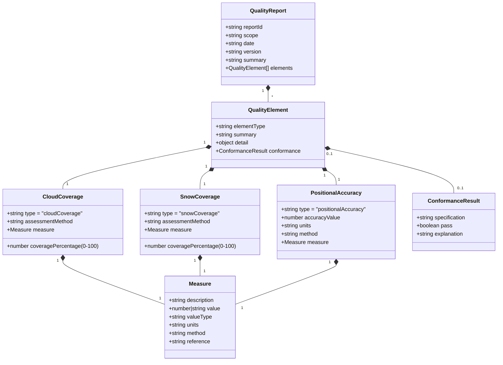
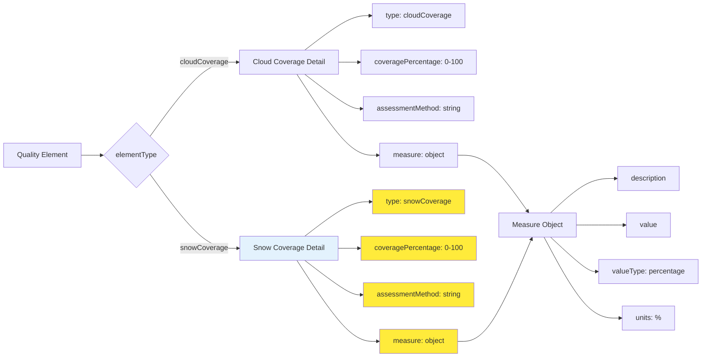
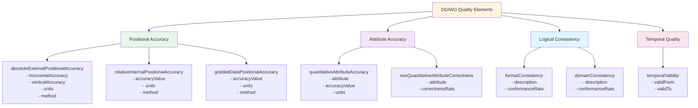
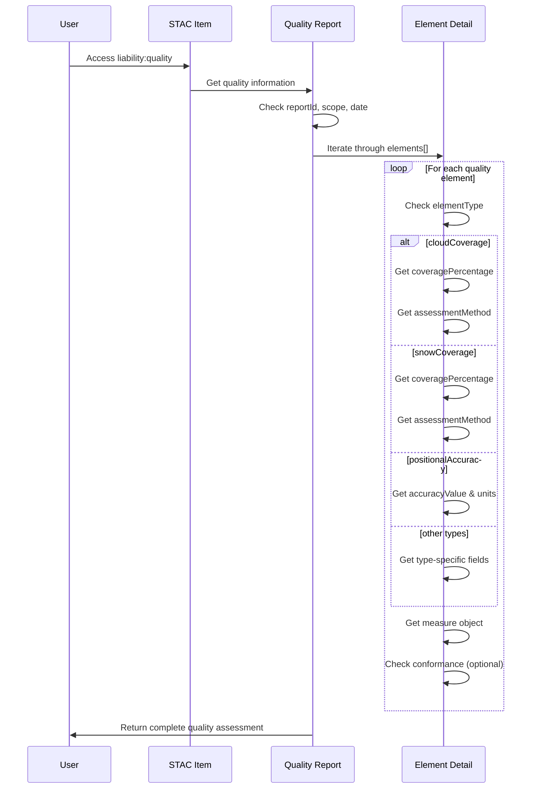
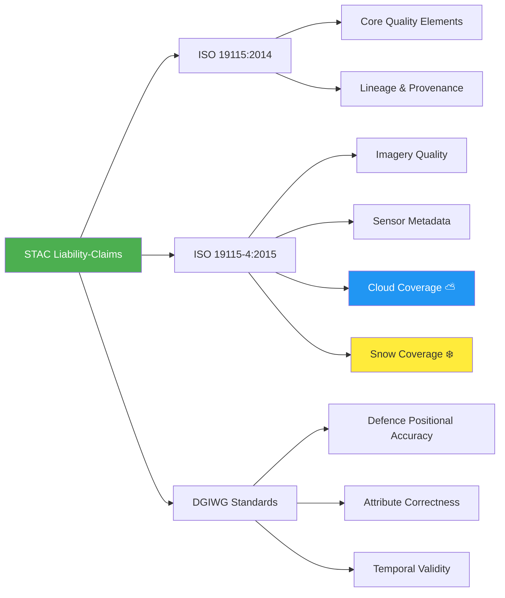

# STAC Liability-Claims Extension - Schema Diagram

## Overall Structure

```mermaid
graph TD
    A[STAC Item/Collection] --> B[liability:* fields]
    A --> C[liability:quality]
    
    B --> B1[liability:claim_id]
    B --> B2[liability:claim_type]
    B --> B3[liability:claim_status]
    B --> B4[liability:responsible_party]
    B --> B5[liability:damages_estimated]
    B --> B6[liability:origin]
    B --> B7[... 14 other fields]
    
    C --> D[ISO 19115 Quality Report]
    
    D --> D1[reportId]
    D --> D2[scope]
    D --> D3[date]
    D --> D4[version]
    D --> D5[summary]
    D --> D6[elements array]
    
    D6 --> E[Quality Elements]
    
    E --> F1[ISO 19115 Core]
    E --> F2[ISO 19115-4 Imagery]
    E --> F3[DGIWG Defence]
    
    F1 --> G1[completeness]
    F1 --> G2[logicalConsistency]
    F1 --> G3[positionalAccuracy]
    F1 --> G4[thematicAccuracy]
    F1 --> G5[temporalAccuracy]
    F1 --> G6[attributeAccuracy]
    F1 --> G7[topologicalConsistency]
    F1 --> G8[lineage]
    
    F2 --> H1[radiometricAccuracy]
    F2 --> H2[sensorQuality]
    F2 --> H3[cloudCoverage]
    F2 --> H4[snowCoverage ⭐NEW]
    F2 --> H5[processingLevel]
    F2 --> H6[usabilityAssessment]
    
    F3 --> I1[absoluteExternalPositionalAccuracy]
    F3 --> I2[relativeInternalPositionalAccuracy]
    F3 --> I3[griddedDataPositionalAccuracy]
    F3 --> I4[nonQuantitativeAttributeCorrectness]
    F3 --> I5[quantitativeAttributeAccuracy]
    F3 --> I6[formatConsistency]
    F3 --> I7[domainConsistency]
    F3 --> I8[temporalValidity]
    
    style C fill:#e1f5ff
    style D fill:#fff4e1
    style F2 fill:#e8f5e9
    style H4 fill:#ffeb3b
```



## Quality Element Structure



## Cloud & Snow Coverage Detail



## DGIWG Quality Elements



## Complete Property Hierarchy

```
STAC Item/Collection
│
├── Standard STAC Properties
│   ├── type
│   ├── stac_version
│   ├── stac_extensions
│   ├── id
│   ├── geometry
│   ├── bbox
│   ├── properties
│   ├── assets
│   └── links
│
└── Liability-Claims Extension (liability:*)
    │
    ├── Core Claim Fields
    │   ├── liability:claim_id
    │   ├── liability:claim_type (environmental|property_damage|personal_injury|financial|operational|other)
    │   ├── liability:claim_status (pending|under_investigation|accepted|rejected|settled|closed)
    │   ├── liability:responsible_party
    │   ├── liability:claim_date
    │   ├── liability:incident_date
    │   ├── liability:resolution_date
    │   └── liability:resolution_status
    │
    ├── Damages & Insurance
    │   ├── liability:damages_estimated
    │   ├── liability:damages_currency (ISO 4217)
    │   ├── liability:insurance_provider
    │   └── liability:policy_number
    │
    ├── Parties & Jurisdiction
    │   ├── liability:affected_parties[]
    │   │   ├── name
    │   │   ├── role
    │   │   └── contact
    │   ├── liability:legal_jurisdiction
    │   └── liability:coverage_area (GeoJSON Geometry)
    │
    ├── Documentation
    │   ├── liability:evidence_refs[] (URIs or Asset keys)
    │   ├── liability:notes
    │   └── liability:origin
    │
    └── Quality Reporting (liability:quality)
        │
        ├── reportId
        ├── scope (dataset|feature|series)
        ├── date (RFC 3339)
        ├── version
        ├── summary
        │
        └── elements[] (Quality Elements)
            │
            ├── elementType (enum)
            ├── summary
            ├── detail (type-specific structure)
            │   │
            │   ├── ISO 19115 Core
            │   │   ├── completeness
            │   │   ├── logicalConsistency
            │   │   ├── positionalAccuracy
            │   │   ├── thematicAccuracy
            │   │   ├── temporalAccuracy
            │   │   ├── attributeAccuracy
            │   │   ├── topologicalConsistency
            │   │   └── lineage
            │   │
            │   ├── ISO 19115-4 Imagery/Gridded Data
            │   │   ├── radiometricAccuracy
            │   │   ├── sensorQuality
            │   │   ├── cloudCoverage ⛅
            │   │   ├── snowCoverage ❄️ NEW
            │   │   ├── processingLevel
            │   │   └── usabilityAssessment
            │   │
            │   └── DGIWG Defence Geospatial
            │       ├── absoluteExternalPositionalAccuracy
            │       ├── relativeInternalPositionalAccuracy
            │       ├── griddedDataPositionalAccuracy
            │       ├── nonQuantitativeAttributeCorrectness
            │       ├── quantitativeAttributeAccuracy
            │       ├── formatConsistency
            │       ├── domainConsistency
            │       └── temporalValidity
            │
            └── conformance (optional)
                ├── specification
                ├── pass (boolean)
                └── explanation
```

## Asset-Level Security Fields

```
STAC Asset
│
└── Liability-Claims Security (asset-level)
    ├── liability:security_classification (public|internal|confidential|restricted|classified)
    ├── liability:access_restrictions[] (array of restriction types)
    ├── liability:access_control (deprecated in v1.1.0)
    │   ├── required_auth
    │   ├── auth_methods[]
    │   └── auth_schemes{}
    │
    └── liability:required_roles[] (v1.1.0 - for API-level enforcement)
```

## Usage Flow



## Key Relationships

1. **STAC Item/Collection** `1:1` **liability:quality** (quality can be object or array)
2. **Quality Report** `1:*` **Quality Elements**
3. **Quality Element** `1:1` **Element Detail** (type-specific)
4. **Element Detail** `1:1` **Measure** (quantitative assessment)
5. **Element Detail** `0:1` **Conformance Result** (optional validation)

## Standards Compliance



---

**Note:** Diagrams are in Mermaid format. View this file in:
- GitHub (native Mermaid rendering)
- VS Code with Mermaid preview extension
- https://mermaid.live (paste diagram code)
- Any Markdown viewer with Mermaid support
